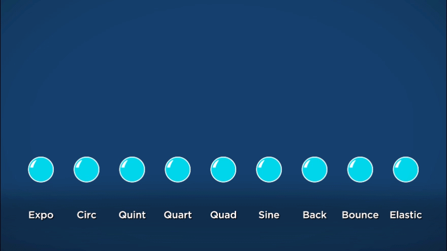
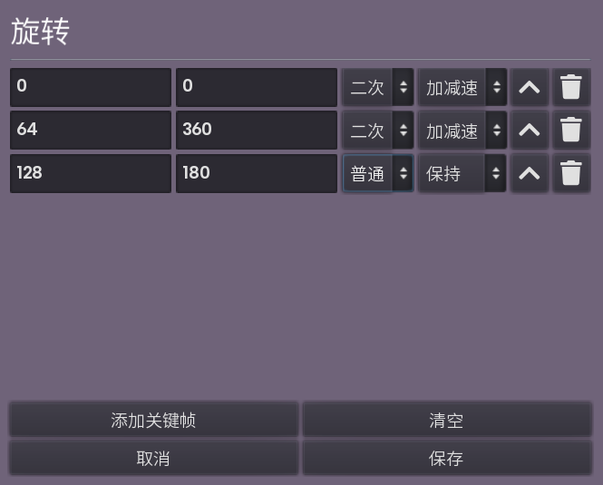

# 动画

Cubio 中实现动画的方式为 **关键帧**（keyframe）。

什么是关键帧？一句话解释：**一头一尾定中间**。原始的手绘动画会绘制许多帧，当这些帧以很快的速度播放时，便形成了流畅的动画。但这种方式无疑对创作带来了极大的困难。随着计算机及相关技术的普及，关键帧的概念开始出现。

在关键帧的设计方式下，创作者只需要指定几个关键的帧，由计算机使用 **插值**（interpolation）方法生成中间的帧。例如，我想实现一段动画，让一个小球在 5 秒时间里从屏幕左端移动到右端。那么我只需要设置两个关键帧：一帧在动画最开始，小球在屏幕左端；一帧在动画开始 5 秒后，小球在屏幕右端。接下来就交给计算机吧!

这里还需要引入 **插值类型**（也称为缓动类型，easing）的概念。最普通的插值类型是 *线性插值*（linear），即在上面的例子中，小球的位置匀速变化，用函数表示即 \\(f(t)=ts\\)，\\(s\\) 为总路程，\\(t\\) 为时间（假设为 \\([0, 1]\\) 间的变量）。但实际上我们还能有其他的插值类型，例如 *二次插值* \\(f(t)=t^2s\\)、*正弦插值* \\(f(t)=sin(t\pi/2)s\\) 等等。它们让小球的运动形式更加多样化、更加自由。常用的插值类型可以在 [这个网站](https://easings.net/) 查看。

在 Cubio Editor 中，许多属性均可以用关键帧动画指定，如物体的位移、颜色、大小等等。编辑关键帧动画的界面如下图所示：

每一行即代表一个关键帧。第一列表示该关键帧的时间（若动画不为空，则需保证第一帧的时间为 `0`），第二列表示该关键帧的值（对于旋转而言，该值的单位是度），第三列是插值类型，第四列是细分的插值类型（对应 <https://easings.net/> 中的 `In`、`Out` 和 `InOut`）。每一个关键帧的插值类型即其到下一帧的中间部分的插值类型。由此，最后一帧的插值类型是无意义的，**但你必须保证其为 普通/保持**。

*普通* 缓动类型比较特殊，其细分的插值类型分别为 `保持`、`跳过` 和 `线性`。`线性` 就不用解释了，`保持` / `跳过` 会使得当前帧与下一帧之间不会有插值，而是分别固定为 这一帧 / 下一帧 的值不变。
